# NSGANetV2: Evolutionary Multi-Objective Surrogate-Assisted Neural Architecture Search [[slides]](https://www.zhichaolu.com/assets/nsganetv2/0343-long.pdf)[[arXiv]](https://arxiv.org/abs/2007.10396)
```BibTex
@inproceedings{
  lu2020nsganetv2,
  title={{NSGANetV2}: Evolutionary Multi-Objective Surrogate-Assisted Neural Architecture Search},
  author={Zhichao Lu and Kalyanmoy Deb and Erik Goodman and Wolfgang Banzhaf and Vishnu Naresh Boddeti},
  booktitle={European Conference on Computer Vision (ECCV)},
  year={2020}
}
```

## Overview
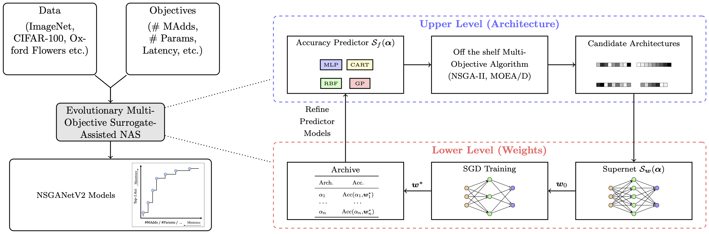
NSGANetV2 is an efficient NAS algorithm for generating task-specific models that are competitive under multiple competing objectives. It comprises of two surrogates, one at the architecture level to improve sample efficiency and one at the weights level, through a supernet, to improve gradient descent training efficiency.

## Datasets 
Download the datasets from the links embedded in the names. Datasets with * can be automatically downloaded.

| Dataset | Type | Train Size | Test Size | #Classes |
|:-:|:-:|:-:|:-:|:-:|
| [ImageNet](http://www.image-net.org/) | multi-class | 1,281,167 | 50,000 | 1,000 |
| [CINIC-10](https://github.com/BayesWatch/cinic-10) |  | 180,000 | 9,000 | 10 |
| [CIFAR-10](https://www.cs.toronto.edu/~kriz/cifar.html)* |  | 50,000 | 10,000 | 10 |
| [CIFAR-100](https://www.cs.toronto.edu/~kriz/cifar.html)* |  | 50,000 | 10,000 | 10 |
| [STL-10](https://ai.stanford.edu/~acoates/stl10/)* |  | 5,000 | 8,000 | 10 |
| [FGVC Aircraft](http://www.robots.ox.ac.uk/~vgg/data/fgvc-aircraft/)* | fine-grained | 6,667 | 3,333 | 100 |
| [DTD](https://www.robots.ox.ac.uk/~vgg/data/dtd/) |  | 3,760 | 1,880 | 47 |
| [Oxford-IIIT Pets](https://www.robots.ox.ac.uk/~vgg/data/pets/) |  | 3,680 | 3,369 | 37 |
| [Oxford Flowers102](https://www.robots.ox.ac.uk/~vgg/data/flowers/102/) |  | 2,040 | 6,149 | 102 |

## How to evalute NSGANetV2 models
Download the models (`net.config`) and weights (`net.init`) from [[Google Drive]](https://drive.google.com/drive/folders/1owwmRNYQc8hIKOOFCYFCl2dukF5y1o-d?usp=sharing) or [[Baidu Yun]](https://pan.baidu.com/s/126FysPlOVTtDb6GQgx7eaA)(提取码：4isq). 
```python
""" NSGANetV2 pretrained models
Syntax: python validation.py \
    --dataset [imagenet/cifar10/...] --data /path/to/data \
    --model /path/to/model/config/file --pretrained /path/to/model/weights 
"""
```
ImageNet               |  CIFAR-10              | CINIC10
:-------------------------:|:-------------------------:|:-------------------------:
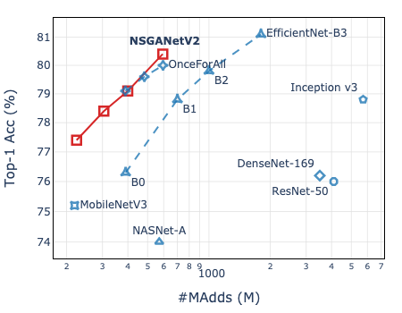  |  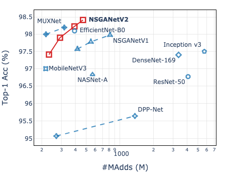   |  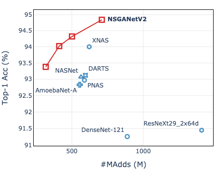
FLOPs@225: [[Google Drive]](https://drive.google.com/drive/folders/1jNvM_JgWBcnIR8mLDmW_0Q6H_EMlZ_97?usp=sharing)<br>FLOPs@312: [[Google Drive]](https://drive.google.com/drive/folders/1w2bRfAGCcDWjVzIPwn9Olqa8sbC5UpjZ?usp=sharing)<br>FLOPs@400: [[Google Drive]](https://drive.google.com/drive/folders/1vwOUzO6iNfyVNi3hgWSx4TANebrCkhri?usp=sharing)<br>FLOPs@593: [[Google Drive]](https://drive.google.com/drive/folders/1r6jk3ausee2PqHsOqessnmmS_3RZYvhY?usp=sharing)  |  FLOPs@232: [[Google Drive]](https://drive.google.com/drive/folders/1-bdVtZdzTCTPWYS4B-03qaoQycYs266Z?usp=sharing)<br>FLOPs@291: [[Google Drive]](https://drive.google.com/drive/folders/1SFuM5zSeqJjSxrNxLEzmixzaU4MvM19t?usp=sharing)<br>FLOPs@392: [[Google Drive]](https://drive.google.com/drive/folders/1sHrTlAB6fQVnAzOIOLUhKWcOQNusTfot?usp=sharing)<br>FLOPs@468: [[Google Drive]](https://drive.google.com/drive/folders/1F5Ar8h3DbpV1WmDfhrtPKmpuQYLFVXq-?usp=sharing)  |  FLOPs@317: [[Google Drive]](https://drive.google.com/drive/folders/1J_vOo1ym9LlATtAQXSehCQt2aJx2Hfm-?usp=sharing)<br>FLOPs@411: [[Google Drive]](https://drive.google.com/drive/folders/1tzjSn_wF9AwiArV7rusCOylu6IxZnCXq?usp=sharing)<br>FLOPs@501: [[Google Drive]](https://drive.google.com/drive/folders/1_u7ZCqMr_3HeOQJfbsq-5oW93ZqNpNpS?usp=sharing)<br>FLOPs@710: [[Google Drive]](https://drive.google.com/drive/folders/1BBnPx-nEPtGNMeixSYkGb2omW-QHO6o_?usp=sharing)  

Flowers102               |  Aircraft              |  Oxford-IIIT Pets
:-------------------------:|:-------------------------:|:-------------------------:
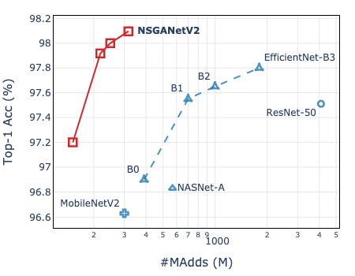  |  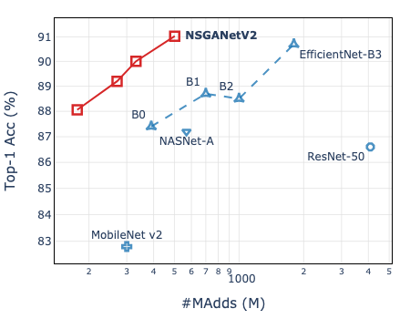   |  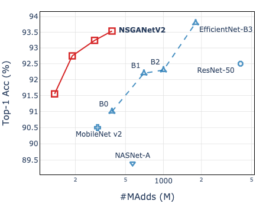
FLOPs@151: [[Google Drive]](https://drive.google.com/drive/folders/12yaZcl_wEYyUkRbLsrTotYtFjlwjIY7g?usp=sharing)<br>FLOPs@218: [[Google Drive]](https://drive.google.com/drive/folders/1i2nWhz0rMeRSLjZ-JcWylssdEQCX_EfT?usp=sharing)<br>FLOPs@249: [[Google Drive]](https://drive.google.com/drive/folders/1maqXm9yRv69tbElGKqHbZVIZXuSQ0uRy?usp=sharing)<br>FLOPs@317: [[Google Drive]](https://drive.google.com/drive/folders/14HK-zEYKr5sySmKbFRbEaQ66IX88e4uC?usp=sharing)  |  FLOPs@176: [[Google Drive]](https://drive.google.com/drive/folders/1q8AcI-zU_z3PIMjbqUEgszvAwL1p-n-5?usp=sharing)<br>FLOPs@271: [[Google Drive]](https://drive.google.com/drive/folders/1VIeOJXaVk6NXrNkGkcShIKP_fEfaZv3Y?usp=sharing)<br>FLOPs@331: [[Google Drive]](https://drive.google.com/drive/folders/1QQ4Lnpoe2obCnf0r6O5yfF3Rh4llZmTg?usp=sharing)<br>FLOPs@502: [[Google Drive]](https://drive.google.com/drive/folders/1yM4nmZMSz7EcB3xHX4QxKV7Ifcpk_KRS?usp=sharing)  |  FLOPs@137: [[Google Drive]](https://drive.google.com/drive/folders/1TWNkSBUQTrpq8IU6eRTHVoVtBtdjThoQ?usp=sharing)<br>FLOPs@189: [[Google Drive]](https://drive.google.com/drive/folders/1Xu-Dh6rDBS608a2p0ebti6mBs33GUSsc?usp=sharing)<br>FLOPs@284: [[Google Drive]](https://drive.google.com/drive/folders/1sNV4FquZifPw-VonjWmogS3LojmwPPd1?usp=sharing)<br>FLOPs@391: [[Google Drive]](https://drive.google.com/drive/folders/1E5PYuI-kb7Gr308kAzIwpo9fzFO4TXVQ?usp=sharing) 

CIFAR-100               |  DTD              |  STL-10
:-------------------------:|:-------------------------:|:-------------------------:
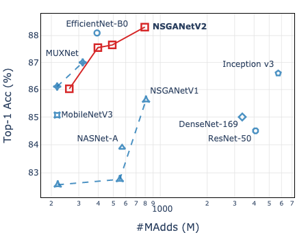  |  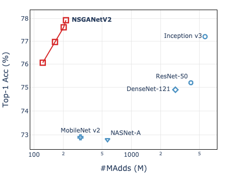   |  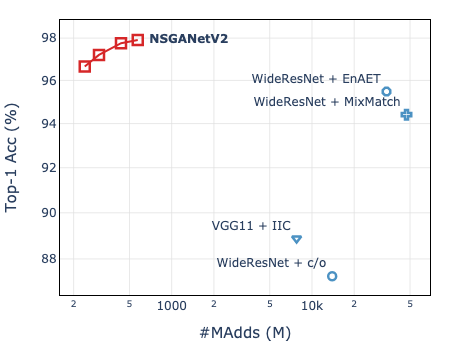
FLOPs@261: [[Google Drive]](https://drive.google.com/drive/folders/1RlnOUhKKaexpwG2pSWiOGSZVGedbf9jd?usp=sharing)<br>FLOPs@398: [[Google Drive]](https://drive.google.com/drive/folders/1aqbQZvX-Zr6OgNi1-k_x-YzWBnzZyL92?usp=sharing)<br>FLOPs@492: [[Google Drive]](https://drive.google.com/drive/folders/1aqbQZvX-Zr6OgNi1-k_x-YzWBnzZyL92?usp=sharing)<br>FLOPs@796: [[Google Drive]](https://drive.google.com/drive/folders/1PJE6rtoJoKChXhw40PHLrT6tjy276ohJ?usp=sharing)  |  FLOPs@123: [[Google Drive]](https://drive.google.com/drive/folders/1isUPK0pHjVmXqDUqXgR3JOvP3zmq-PgJ?usp=sharing)<br>FLOPs@164: [[Google Drive]](https://drive.google.com/drive/folders/1pRGHy-bbw9Gz2g2QHau4z7dNFOdKT_w2?usp=sharing)<br>FLOPs@202: [[Google Drive]](https://drive.google.com/drive/folders/1CsGdcIv79rTDQbXSEJEgTOYZ6ViRwz1S?usp=sharing)<br>FLOPs@213: [[Google Drive]](https://drive.google.com/drive/folders/1MJVapbO7V5fT5Vjf1G0wjkgCOgkLKWEa?usp=sharing)  |  FLOPs@240: [[Google Drive]](https://drive.google.com/drive/folders/1tHOiEJhOpplOPnNqaDkHGPGfD5YRZrsJ?usp=sharing)<br>FLOPs@303: [[Google Drive]](https://drive.google.com/drive/folders/1IfFeg0CkPEFNN3iseOyeR1u-sozgSaya?usp=sharing)<br>FLOPs@436: [[Google Drive]](https://drive.google.com/drive/folders/13naG888dNouXj8Bd-gL4pMzrskDwdBC8?usp=sharing)<br>FLOPs@573: [[Google Drive]](https://drive.google.com/drive/folders/1iig97a1Xr-K40xbgwgBvMOPe8aLaqW2a?usp=sharing) 

## How to use MSuNAS to search
```python
""" Bi-objective search
Syntax: python msunas.py \
    --dataset [imagenet/cifar10/...] --data /path/to/dataset/images \
    --save search-xxx \ # dir to save search results
    --sec_obj [params/flops/cpu] \ # objective (in addition to top-1 acc)
    --n_gpus 8 \ # number of available gpus
    --supernet_path /path/to/supernet/weights \
    --vld_size [10000/5000/...] \ # number of subset images from training set to guide search
    --n_epochs [0/5]
"""
```
- Download the pre-trained (on ImageNet) supernet from [here](https://hanlab.mit.edu/files/OnceForAll/ofa_nets/).
- It supports searching for *FLOPs*, *Params*, and *Latency* as the second objective. 
  - To optimize latency on your own device, you need to first construct a `look-up-table` for your own device, like [this](https://github.com/mikelzc1990/nsganetv2/blob/master/data/i7-8700K_lut.yaml).
- Choose an appropriate `--vld_size` to guide the search, e.g. 10,000 for ImageNet, 5,000 for CIFAR-10/100. 
- Set `--n_epochs` to `0` for ImageNet and `5` for all other datasets.
- See [here](https://github.com/mikelzc1990/nsganetv2/blob/master/scripts/search.sh) for some examples.
- Output file structure:
  - Every architecture sampled during search has `net_x.subnet` and `net_x.stats` stored in the corresponding iteration dir. 
  - A stats file is generated by the end of each iteration, `iter_x.stats`; it stores every architectures evaluated so far in `["archive"]`, and iteration-wise statistics, e.g. hypervolume in `["hv"]`, accuracy predictor related in `["surrogate"]`.
  - In case any architectures failed to evaluate during search, you may re-visit them in `failed` sub-dir under experiment dir. 
  
ImageNet             |  CIFAR-10
:-------------------------:|:-------------------------:
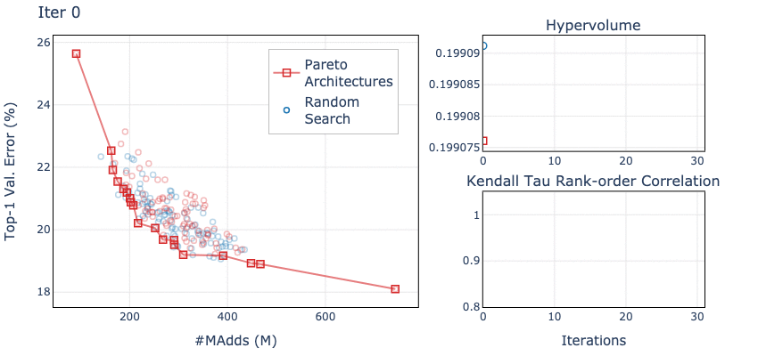  |  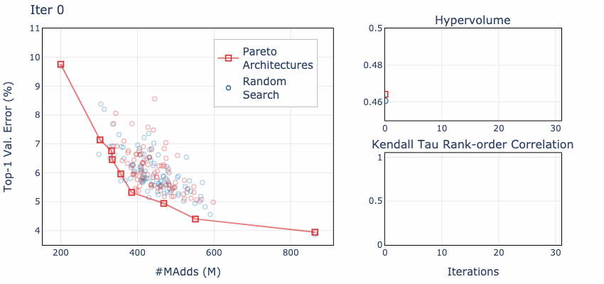

## How to choose architectures
Once the search is completed, you can choose suitable architectures by:
- You have preferences, e.g. architectures with xx.x% top-1 acc. and xxxM FLOPs, etc.
```python
""" Find architectures with objectives close to your preferences
Syntax: python post_search.py \
    -n 3 \ # number of desired architectures you want, the most accurate archecture will always be selected 
    --save search-imagenet/final \ # path to the dir to store the selected architectures 
    --expr search-imagenet/iter_30.stats \ # path to last iteration stats file in experiment dir 
    --prefer top1#80+flops#150 \ # your preferences, i.e. you want an architecture with 80% top-1 acc. and 150M FLOPs 
    --supernet_path /path/to/imagenet/supernet/weights \
"""
```
- If you do not have preferences, pass `None` to argument `--prefer`, architectures will then be selected based on trade-offs. 
- All selected architectures should have three files created:
  - `net.subnet`: use to sample the architecture from the supernet
  - `net.config`: configuration file that defines the full architectural components
  - `net.inherited`: the inherited weights from supernet

## How to validate architectures
To realize the full potential of the searched architectures, we further fine-tune from the inherited weights. Assuming that you have both `net.config` and `net.inherited` files. 
```python
""" Fine-tune on ImageNet from inherited weights
Syntax: sh scripts/distributed_train.sh 8 \ # of available gpus
    /path/to/imagenet/data/ \
    --model [nsganetv2_s/nsganetv2_m/...] \ # just for naming the output dir
    --model-config /path/to/model/.config/file \
    --initial-checkpoint /path/to/model/.inherited/file \
    --img-size [192, ..., 224, ..., 256] \ # image resolution, check "r" in net.subnet
    -b 128 --sched step --epochs 450 --decay-epochs 2.4 --decay-rate .97 \
    --opt rmsproptf --opt-eps .001 -j 6 --warmup-lr 1e-6 \
    --weight-decay 1e-5 --drop 0.2 --drop-path 0.2 --model-ema --model-ema-decay 0.9999 \
    --aa rand-m9-mstd0.5 --remode pixel --reprob 0.2 --amp --lr .024 \
    --teacher /path/to/supernet/weights \
"""
```
- Adjust learning rate as `(batch_size_per_gpu * #GPUs / 256) * 0.006` depending on your system config.
```python
""" Fine-tune on CIFAR-10 from inherited weights
Syntax: python train_cifar.py \
    --data /path/to/CIFAR-10/data/ \
    --model [nsganetv2_s/nsganetv2_m/...] \ # just for naming the output dir
    --model-config /path/to/model/.config/file \
    --img-size [192, ..., 224, ..., 256] \ # image resolution, check "r" in net.subnet
    --drop 0.2 --drop-path 0.2 \
    --cutout --autoaugment --save
"""
```

## More Use Cases (coming soon) 
- [ ] With a different supernet (search space).
- [ ] NASBench 101/201.
- [ ] Architecture visualization.

## Requirements
- Python 3.7
- Cython 0.29 (optional; makes `non_dominated_sorting` faster in pymoo)
- PyTorch 1.5.1
- [pymoo](https://github.com/msu-coinlab/pymoo) 0.4.1
- [torchprofile](https://github.com/zhijian-liu/torchprofile) 0.0.1  (for FLOPs calculation)
- [OnceForAll](https://github.com/mit-han-lab/once-for-all) 0.0.4  (lower level supernet)
- [timm](https://github.com/rwightman/pytorch-image-models) 0.1.30  
- [pySOT](https://github.com/dme65/pySOT) 0.2.3  (RBF surrogate model) 
- [pydacefit](https://github.com/msu-coinlab/pydacefit) 1.0.1  (GP surrogate model) 
